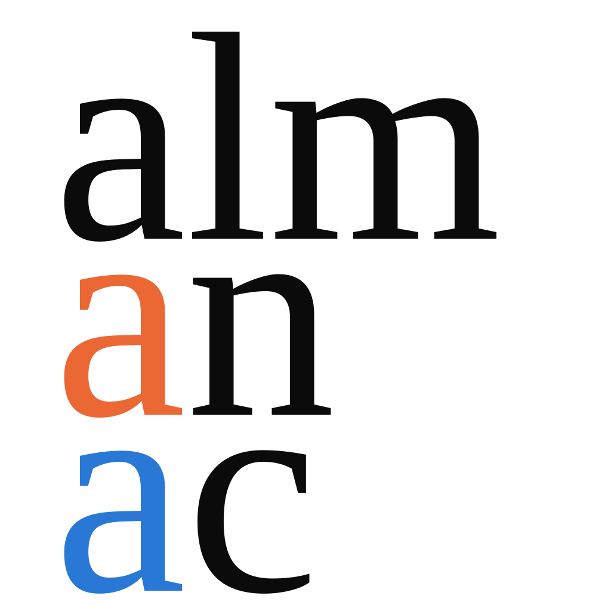

<picture>
  <source media="(prefers-color-scheme: dark)" srcset="edition/almanac-mark-dark.svg">
  
</picture>

# AlmanacA0a — the centre of the even hybrid family quantum GL(1)

*The pilot edition. A complete record of one small mathematical result, in three layers, with a
per-claim account of what warrants each one.*

**Start here: [open the almanac](https://almanaca0a-02b24b.gitlabpages.ista.ac.at/).**

**Whole almanac:
[Download `AlmanacA0a.zip`](https://github.com/almanac-editions/AlmanacA0a/raw/main/AlmanacA0a.zip)** — it unzips to exactly this folder.

---

## What an almanac is

An almanac is its own kind of publication — a **citable, versioned package a reader downloads**:
the informal proof a mathematician would read, the computational instrument the calculations
actually ran on, and the machine-checked formal development — held together by one file,
`edition/CONCORDANCE.json`, that joins all three layers claim by claim and records **what certifies each
one**.

The concordance — joining the three layers claim by claim — is what turns three parallel
archives into a single edition.

## What each warrant means

Every result carries exactly one warrant — **three different kinds of check**.

| warrant | what it means | how many |
|---|---|---|
| <picture><source media="(prefers-color-scheme: dark)" srcset="edition/w-ink-dark.svg"></picture> | an argument written for a human reader and **refereed** | 1 |
| <picture><source media="(prefers-color-scheme: dark)" srcset="edition/w-orange-dark.svg"></picture> | verified by computation over a **stated bound, which is part of the claim** | **2** |
| <picture><source media="(prefers-color-scheme: dark)" srcset="edition/w-blue-dark.svg"></picture> | a proof kernel checked a proof of *that statement* | **9** |

A kernel certifies **the formal statement**. Whether that statement is faithful to the informal one
can be decided from the warrants above and the convention frame carried on every row.

## Where to go

| to… | read |
|---|---|
| read the mathematics | **`edition/paper.pdf`** — the paper, 12 pp.: the statement for general *n*, and the case *n* = 1 proved |
| read it at length, without LaTeX | **`edition/almanac.explained.html`** — the same mathematics explained for a general reader |
| look around | **`edition/index.html`** — interactive, offline |
| check any of it independently | **`edition/FOR_A_HUMAN.md`** — including how to install every piece of software from scratch |
| hand it to an AI assistant | **`AGENTS.md`** at the root — it routes to `edition/FOR_AN_AI_AGENT.md` |
| see what warrants what | **`edition/CONCORDANCE.json`**, and `edition/EDITION.md` for the whole |
| confirm every file is intact | **`edition/CHECKSUMS.txt`** (`cd edition && shasum -a 256 -c CHECKSUMS.txt`) |

## Reproducing it

The toolchain is pinned **to exact versions** — a proof that compiles today compiles against
*that* specific Mathlib revision:

- Lean `leanprover/lean4:v4.30.0`
- Mathlib `c5ea00351c28e24afc9f0f84379aa41082b1188f`
- Julia 1.12.6, OSCAR 1.8.0 (`Manifest.toml` is the pin; `Project.toml` states only ranges)

Everything runs entirely on a local machine, **self-contained and service-free.**
A pinned toolchain makes a re-run *possible*, not *identical* — `edition/MANIFEST.json` →
`reproducibility_recipe` says exactly what the pin does and does not promise.

## Citing it

**Citable identifiers arrive only with the frozen edition of record, deliberately.** An identifier
should mean *this is citable*, and this build's own front page directs citation to the edition of
record. `CITATION.cff` and the DOI both ship with the frozen edition, which is what enters the
citable sequence. Editions are versioned, and a later edition supersedes an earlier one
while the earlier stays citable exactly as deposited.
